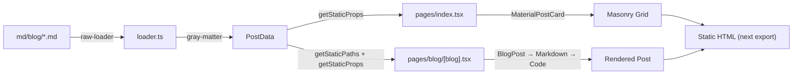

# Modernize dev.lwlx.xyz — Next.js Blog Rewrite

## Current Architecture Summary

### Tech Stack (Legacy → Target)
| Area | Current | Version | Target |
|---|---|---|---|
| **Framework** | Next.js (Pages Router) | `^12.3.4` | **Next.js 16.2.x** (App Router) |
| **React** | React 18 | `^18.3.1` | **React 19.2.x** |
| **UI Library** | MUI v5 + Emotion | `^5.16.14` | **MUI v9.0.x** |
| **Markdown** | `react-markdown` v5 + `gray-matter` | `^5.0.3` | **unified/remark/rehype** |
| **MD Loading** | Webpack `raw-loader` + dynamic `import()` | `^4.0.2` | **Node.js `fs` (Server Components)** |
| **Syntax Highlighting** | `react-syntax-highlighter` (Prism) | `^15.6.1` | **Shiki** (via `rehype-pretty-code`) |
| **RSS** | `rss` + `showdown` (MD→HTML) | `^1.2.2` | **`rss`** (keep, replace showdown) |
| **Date Formatting** | `fecha` | `^4.2.3` | **Native `Intl.DateTimeFormat`** |
| **Styling** | MUI `makeStyles` (v4 compat shim), inline styles, styled-jsx global | — | **MUI `sx` prop / `styled()`** |
| **Package Manager** | Yarn Classic | `^1.22.10` | Yarn Classic (keep) |
| **TypeScript** | TS 5.x, targeting ES5 | `^5.8.2` | **TS 5.x, targeting ES2017+** |
| **Build CI** | GitHub Actions → `yarn build` + `yarn export` | — | **`yarn build`** (supports both modes) |

### Architecture Flow

**Key observations:**

1. **Pages Router** — uses `getStaticPaths` / `getStaticProps` for SSG. `next export` produces static HTML. The `next export` command was removed in Next.js 13+; modern equivalent is `output: 'export'` in `next.config.js`. Since you plan to run this as a Node.js app in the future, we'll configure the site to work as a **standard Node.js server by default**, with `output: 'export'` available as an optional alternative.
2. **Markdown Pipeline** — `raw-loader` webpack rule imports `.md` files as strings → `gray-matter` extracts frontmatter → `react-markdown` v5 renders with custom `<Code>` renderer using PrismJS. The v5 API (`source=`, `renderers=`, `with-html` import path) is fully deprecated in react-markdown v6+.
3. **MUI Styling** — Heavy use of `@mui/styles/makeStyles` (the legacy JSS-based API deprecated in MUI v5, completely removed in v6+). MUI v9 does not support `makeStyles` at all — all styling must migrate to `sx` prop / `styled()` API.
4. **RSS Generation** — Currently commented out. Uses `showdown` to convert MD→HTML at build time.
5. **Sitemap** — `sitemap.ts` exists but is broken/incomplete (returns hardcoded XML, imports `getStaticPaths` from the page file).
6. **Image handling** — Custom `<Image>` atom that manually constructs WebP/JPG `<picture>` elements. Does not use `next/image`.

---

## Proposed Step-by-Step Plan

> [!IMPORTANT]
> Each step is isolated and independently verifiable. I will explain and ask for approval before executing each one.

---

### Step 1 — Upgrade Dependencies & Scaffold App Router

**Goal:** Upgrade Next.js to **16.2.x**, React to **19.2.x**, MUI to **v9.0.x**, and scaffold the `app/` directory alongside the existing `pages/` (Next.js supports both concurrently during migration).

**Changes:**
- Update `package.json`: `next@^16.2`, `react@^19.2`, `react-dom@^19.2`, `@mui/material@^9`, new TS types
- Remove deprecated `next export` script (replaced by optional `output: 'export'` config)
- Convert `next.config.js` → `next.config.ts` (default: Node.js server mode; add a comment showing how to enable `output: 'export'` for static builds)
- Remove `raw-loader` (no longer needed — we'll read MD files via `fs` in server components)
- Remove `@mui/styles` package entirely (incompatible with React 19 and MUI v9)
- Create minimal `app/layout.tsx` (root layout with fonts, MUI ThemeProvider, Header, Footer)
- Update `tsconfig.json` target from `es5` to `es2017`+, add `"moduleResolution": "bundler"`
- Verify the site still builds with `next build`

> [!WARNING]
> **MUI v5 → v9 is a major jump.** `@mui/styles` (makeStyles/JSS) is completely gone. All `makeStyles` usage in `MaterialPostCard.tsx` and `FollowButton.jsx` must be converted to `sx` prop or `styled()` in Step 4. The component API itself (Card, Box, Typography, etc.) remains largely the same across v5→v9, so the visual output will be preserved.

---

### Step 2 — Modernize the Markdown Pipeline (Server-Side)

**Goal:** Replace `raw-loader` + `import()` + `react-markdown` v5 with a clean Node.js `fs`-based pipeline using modern libraries, all executed as **Server Components** at build time.

**New pipeline:**
1. `fs.readFileSync` to read `.md` files (no webpack loader needed)
2. `gray-matter` to parse frontmatter (keep as-is, it's excellent)
3. **`unified` / `remark` / `rehype`** stack to convert MD→HTML with syntax highlighting via `rehype-pretty-code` (uses Shiki — faster, better theme support than Prism)
4. The rendered HTML string is passed to a client component that `dangerouslySetInnerHTML`s it (preserving the existing CSS classes)

**Why this over `next-mdx-remote` / `contentlayer`?**
- `contentlayer` is abandoned/unmaintained
- `next-mdx-remote` adds MDX complexity you don't need (your posts are plain Markdown)
- `unified` is the industry standard, zero lock-in, and perfectly pairs with Server Components

**Preserving Visual Continuity:**
- The custom Prism theme from `Code.tsx` will be ported to an equivalent Shiki theme (same hex colors: `#f07693`, `#1177ab`, `#4499ee`, etc.)
- The `.lwlx-markdown` CSS class and all its rules will be preserved in a global CSS file

---

### Step 3 — Migrate Routes to App Router

**Goal:** Move `pages/index.tsx` and `pages/blog/[blog].tsx` to `app/` equivalents.

| Old (Pages Router) | New (App Router) |
|---|---|
| `pages/index.tsx` | `app/page.tsx` (Server Component) |
| `pages/blog/[blog].tsx` | `app/blog/[slug]/page.tsx` (Server Component) |
| `pages/_app.tsx` | `app/layout.tsx` (already created in Step 1) |

- `getStaticPaths` → `generateStaticParams`
- `getStaticProps` → direct `async` function at the top of the Server Component
- Delete `pages/` directory after verifying parity

---

### Step 4 — Adapt Components for Modern React

**Goal:** Migrate components from class/legacy patterns to modern functional React.

| Component | Change |
|---|---|
| `Code.tsx` | Remove (replaced by `rehype-pretty-code` in Step 2) |
| `Markdown.tsx` | Simplify to render pre-built HTML + keep global CSS |
| `MaterialPostCard.tsx` | Replace `makeStyles` → MUI v9 `sx` prop / `styled()` (already partially uses `sx`) |
| `FollowButton.jsx` | Convert to `.tsx`, replace `makeStyles` → `sx` prop |
| `PostCard.tsx` | Minor cleanup (already modern) |
| `Header.tsx`, `Footer.tsx` | Move to `app/` layout, keep styles intact |
| `Author.tsx` | Fix imports (`from 'loader'` → relative), minor cleanup |
| `atoms/Image.tsx` | Consider migrating to `next/image` for optimization |
| `theme.js` | Convert to `theme.ts`, update `createTheme` for MUI v9 API if needed |

> [!NOTE]
> Components will be **adapted**, not rewritten from scratch, per the CLAUDE.md prime directive. The MUI v9 migration primarily affects styling APIs (`makeStyles` → `sx`/`styled`), not component structure.

---

### Step 5 — Port SEO, RSS, and Sitemap

**Goal:** Ensure SEO metadata, Open Graph tags, RSS feed, and a working sitemap are all ported.

- **SEO:** Use Next.js App Router's `metadata` export (static) and `generateMetadata` (dynamic) instead of `<Head>` tags
- **RSS:** Re-enable RSS generation at build time, replace `showdown` with the new `unified` pipeline for MD→HTML conversion
- **Sitemap:** Use `app/sitemap.ts` (Next.js built-in convention) to auto-generate `/sitemap.xml`
- **robots.txt:** Add `app/robots.ts` for good measure

---

### Step 6 — Update CI/CD & Final Polish

**Goal:** Ensure the GitHub Actions pipeline, build output, and developer workflow all work correctly.

- Update `build-ci.yml`: remove `yarn export` step, update action versions (`actions/checkout@v4`, `actions/setup-node@v4`, etc.)
- Test the full "add a new `.md` file → push → site builds" workflow
- Verify both deployment modes work:
  - **Node.js server:** `yarn build && yarn start` serves the site
  - **Static export:** `output: 'export'` in config → `yarn build` produces `/out` directory
- Clean up any dead code, unused dependencies
- Run final build + type check

---

## Open Questions

> [!IMPORTANT]
> **MUI v9 confirmed.** We'll jump straight to MUI v9.0.x. This means `@mui/styles` (makeStyles) is completely removed — all styling will be migrated to `sx` prop / `styled()`. The core MUI component API (Card, Box, Typography, etc.) is stable across versions, so the visual output will be preserved. Any v9-specific breaking changes (e.g., prop renames) will be handled in Step 4.

> [!IMPORTANT]
> **Shiki theme for syntax highlighting:** I'll create a custom Shiki theme that matches your current Prism color palette exactly (the neumorphic dark blocks with `#f07693` accents). Are you happy with this approach, or would you prefer to stick with Prism via `rehype-prism-plus`?

> [!IMPORTANT]
> **`next/image` migration:** Your custom `<Image>` atom manually builds `<picture>` with `.webp` / `.jpg` fallback. `next/image` handles this automatically with better optimization. However, since your images are in `/public/` with specific naming conventions (e.g., `bannerPhoto: /htb/htb-black-hole` → loads `.webp` and `.jpg`), migration needs care. Should I migrate to `next/image`, or leave the custom `<Image>` atom as-is?

> [!IMPORTANT]
> **Deployment model:** The site will default to **Node.js server mode** (`next start`), which is the standard for Next.js 16. Static export via `output: 'export'` will remain available as a config toggle. This gives you the flexibility to deploy as either a server app or a static site. Agree?

---

## Verification Plan

### After Each Step
- `next build` must succeed with zero errors (both server and static export modes)
- Visual diff: screenshot the homepage and a blog post before and after

### Final Verification
- `next build && next start` runs the site as a Node.js server
- `output: 'export'` toggle produces static export in `/out`
- All 20 blog posts render correctly with syntax highlighting
- SEO meta tags present in HTML source
- RSS feed generates valid XML
- Sitemap generates valid XML
- `next dev` runs without warnings
- Zero TypeScript errors
